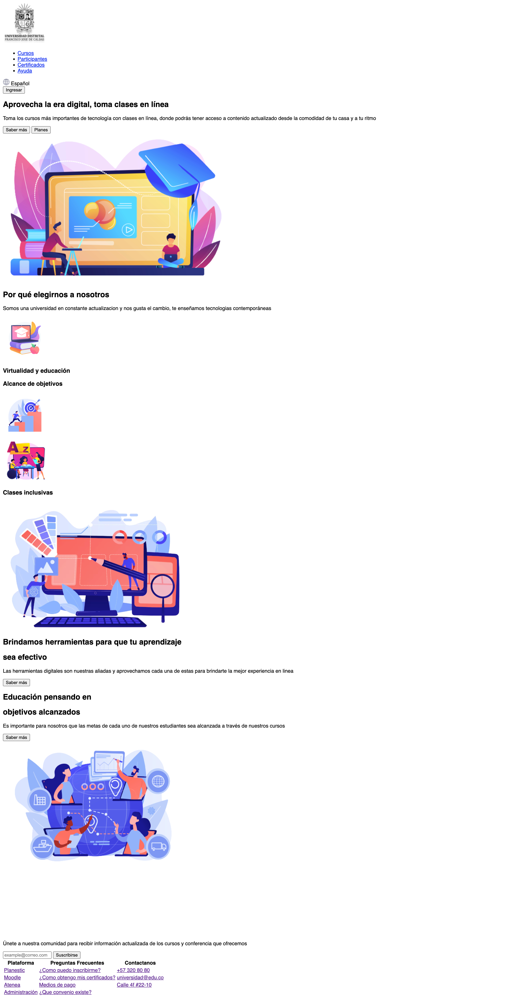

<h1>Taller 9 - Juan David Ramirez Rodriguez</h1>

<h2>Informacion</h2>

Curso: Full Stack Basico - Grupo 1

Profesor: Cristian Patiño

<h2>Link de la pagina</h2>

<h2>Punto 1: Link de Figma</h2>

<a href="https://www.figma.com/file/p6P4MxfltzanhuuMl05lx1/Juan-David-Ramirez-Rodriguez?type=design&node-id=0%3A1&mode=design&t=wegiIv5AI2fDnGEn-1">Link de Figma</a>

<h2>Punto 2: Diseño en HTML</h2>

<h2>Punto 3: Diseño con CSS</h2>

<h2>Punto 4: Titulo</h2>

<h2>Punto 5: Párrafo</h2>

<h2>Punto 6: Links</h2>

<h2>Punto 7 y 8: Navegacion</h2>

<h2>Punto 9: Tabla</h2>

